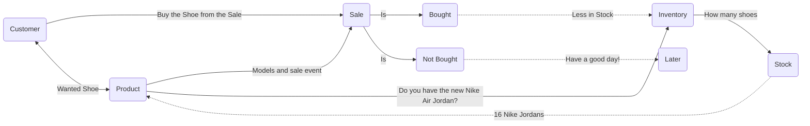

### This shoes how the Nike store functions with getting and providing shoes to customers. 
#### Products is responsible for providing models for the shoe and gives a sale.
#### Customers get attrated to the sales of the Shoe and the model
#### Customers would either Buy or dont buy the shoe from the deal
#### If they do buy the shoe, then the stock of the shoe dcreases
#### If there is no deal, then the customer leaves the store
#####
